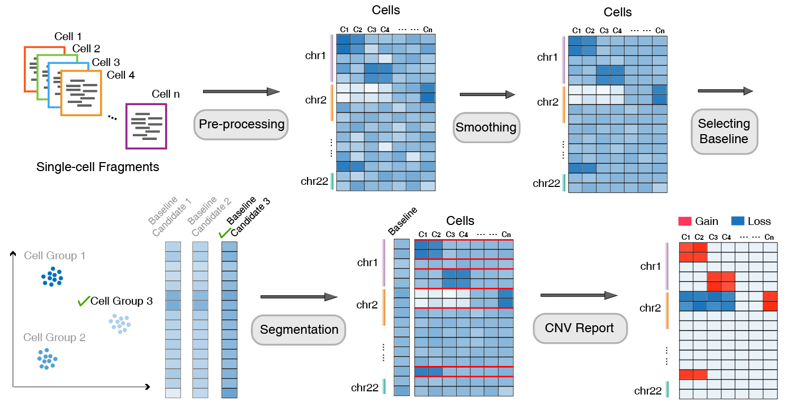

# AtaCNV
This is the R package implementation for AtaCNA, a CNA detection algorithm for scATAC-seq datasets. The method is presented in paper "Detecting copy number variations from single-cell chromatin accessibility sequencing data by AtaCNA". 

**Note**: The method name in paper has been changed to AtaCNA in the final version, while this R package retains the original name, AtaCNV. Here, CNA refers to somatic CNV, which is a more precise term in biology.

# Workflow



AtaCNV takes a single-cell read count matrix over genomic bins of 1 million base pairs (1 Mbp) as input. Firstly, cells and genomic bins are filtered according to bin mappability and the number of zero entries. To reduce the extreme noisiness, AtaCNV then smooths the count matrix by fitting a one-order dynamic linear model for each cell. AtaCNV also performs cell-wise local regression to remove the potential biases caused by GC content. If normal cells are available, AtaCNV normalizes the smoothed count data against those of normal cells to deconvolute copy number signals from other confounding factors like chromatin accessibility. If normal cells are not available, observing that tumor single-cell data often contain many non-tumor cells, AtaCNV clusters the cells and identifies a group of high confidence normal cells and normalizes the data against their smoothed depth data. Then, AtaCNV applies the multi-sample BIC-seq algorithm to jointly segment all single cells and estimates copy ratios of the obtained segments for each cell. Using the copy ratio data, AtaCNV calculates a burden score for each cell group and classifies cell groups with high CNA burden as malignant cells. For tumor cells, AtaCNV further infers their discrete copy number states using a Bayesian method.

# Installation
Install dependencies:
```
install.packages("devtools")
install.packages("BiocManager")
BiocManager::install("edgeR")
BiocManager::install("ComplexHeatmap")
devtools::install_github("bowang-lab/simATAC")
```
Install AtaCNV:
```
devtools::install_github("Aelita-Stone/AtaCNV")
```

# Usage
Based on the workflow, the R package primarily includes three modules: normalization, segmentation, and copy number state inference. More detailed instructions can be found in the R package documentation and the examples in [tutorial](tutorial.md).

### Normalization
Using count matrix as input, AtaCNV removes confounding factors like GC content to deconvolute CNA signals. Based on the available information, this function provides four modes to calculate the baseline read counts for non-tumor cells. 
```
norm_re <- AtaCNV::normalize(count,
                             genome = "hg19", 
                             mode = "normal cells",
                             normal_cells = cell_type=="normal",
                             output_dir = "./",
                             output_name = "norm_re.rds"
                             gc_correction = TRUE
                             )
```

### Segmentation
AtaCNV utilizes BICseq to infer potential breakpoints and calculate segment-wise copy ratios. The parameter `lambda` can be adjusted to control the resolution of segmentation. A larger value will result in longer CNA segments.
```
seg_re <- AtaCNV::calculate_CNV(norm_count = norm_re$norm_count,
                                baseline = norm_re$baseline,
                                output_dir = "./",
                                output_name = "CNV_re.rds")
```

### Copy state inference
For tumor cells, AtaCNV infers their consensus discrete copy number states. 
```
CN_state <- AtaCNV::estimate_cnv_state_cluster(count = count,
                                               genome = "hg19",
                                               copy_ratio = norm_re$copy_ratio,
                                               bkp = seg_re$bkp,
                                               label = cell_type)
```

# Contact
Author and maintainer: Xiaochen Wang ([xcwang1998@pku.edu.cn](mailto:xcwang1998@pku.edu.cn))

